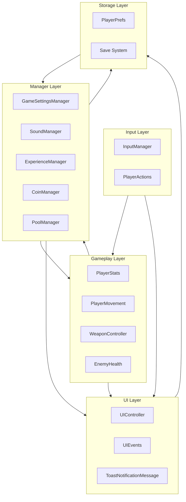
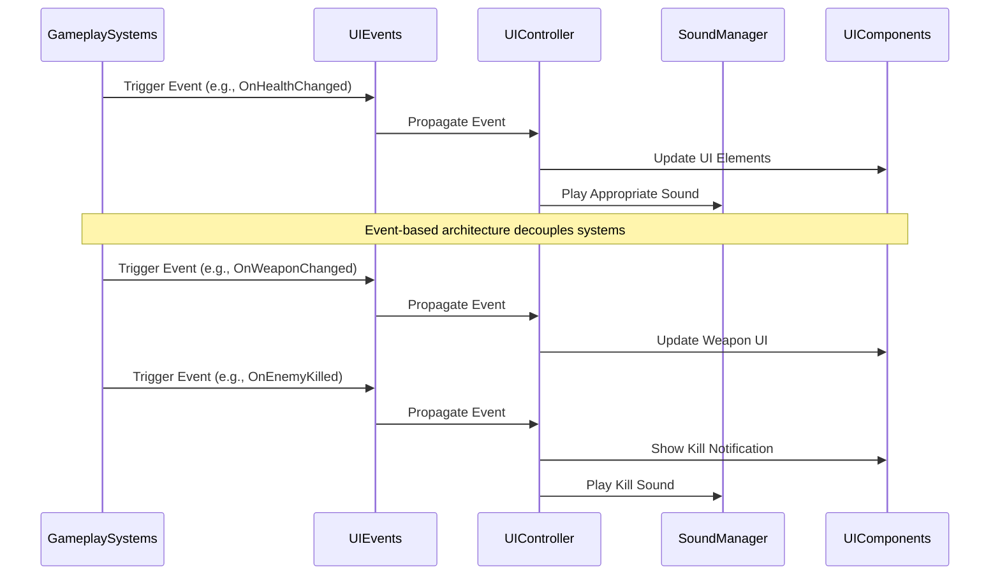
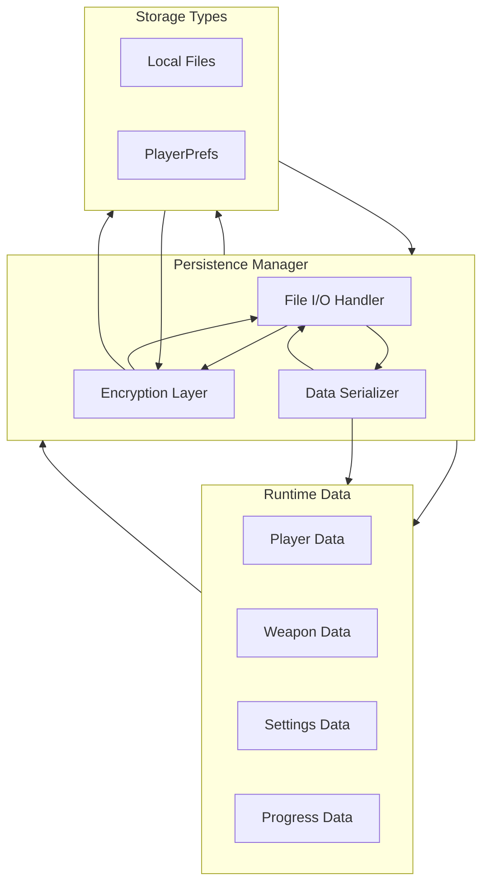
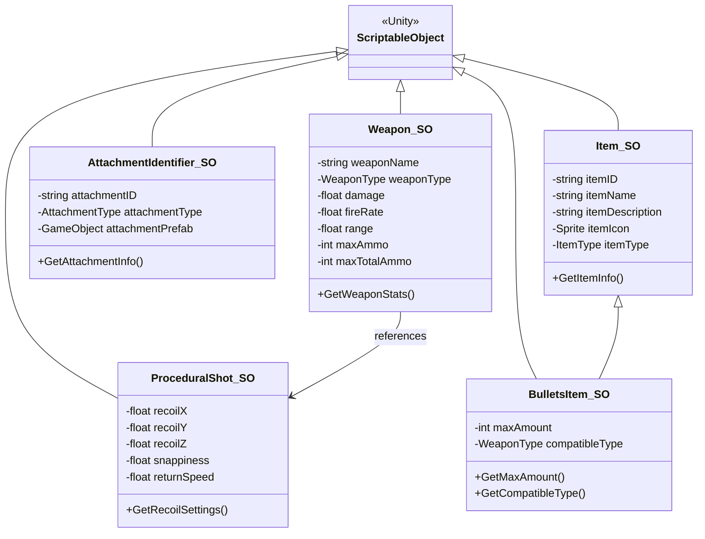
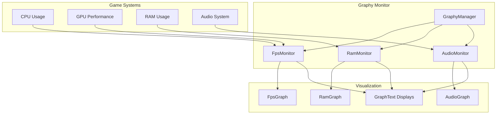
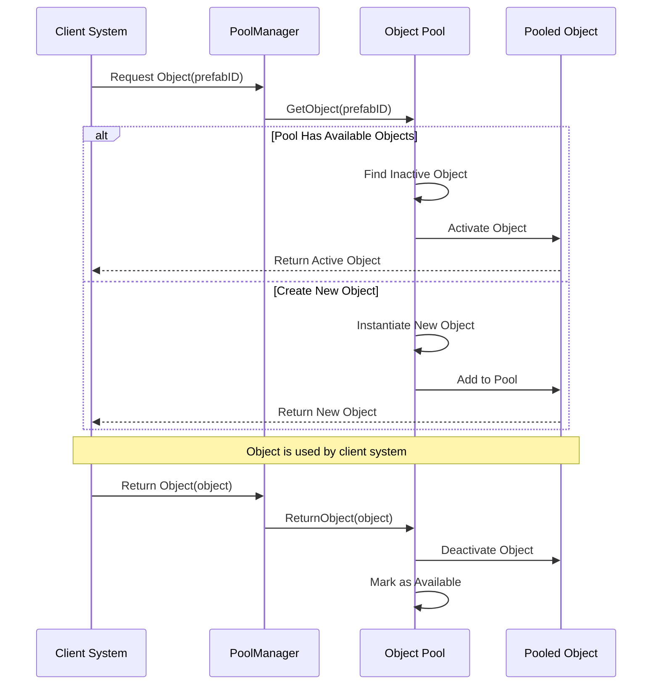

# Data Flow

This diagram details the Data Flow architecture in Carrot Clash, showing how information moves between different systems, how events are propagated, and how persistent data is managed.

## Core System Data Flow

## Event-Based Communication

## Data Persistence Flow

## ScriptableObject Data Architecture

## Performance Monitoring Data Flow

## Object Pooling Data Flow

The Data Flow architecture in Carrot Clash is designed for efficient communication between systems:

1. **Core System Data Flow**:
   - Layered architecture with clear data paths between input, gameplay, management, UI, and storage
   - Directional flow showing how data cascades through the system layers

2. **Event-Based Communication**:
   - Decoupled systems communicating through events rather than direct references
   - UIEvents serving as a central event bus for UI-related notifications
   - Clear sequence of event propagation from gameplay systems to UI components

3. **Data Persistence Flow**:
   - Structured approach to saving and loading game data
   - Multi-layered process including serialization, encryption, and storage
   - Support for different storage methods (local files and PlayerPrefs)

4. **ScriptableObject-Based Data Architecture**:
   - Extensive use of ScriptableObjects for shareable configuration data
   - Clear inheritance and relationship model between different data types
   - Decoupling of data from behavior through ScriptableObject references

5. **Performance Monitoring**:
   - Comprehensive monitoring of system performance through Graphy
   - Data collection from various system components (CPU, GPU, RAM, Audio)
   - Visualization through graphs and text displays

6. **Object Pooling**:
   - Efficient resource management through object pooling
   - Clear request and return flow between client systems and the pool manager
   - Optimization for frequently instantiated/destroyed objects

These data flow patterns facilitate:
- Maintainable code through decoupled systems
- Scalable architecture that can handle increasing complexity
- Optimized performance through efficient resource management
- Robust data handling with proper persistence mechanisms

The data flow architecture serves as the foundation for communication between all game systems, ensuring that information moves efficiently throughout the application while maintaining clean separation of concerns.