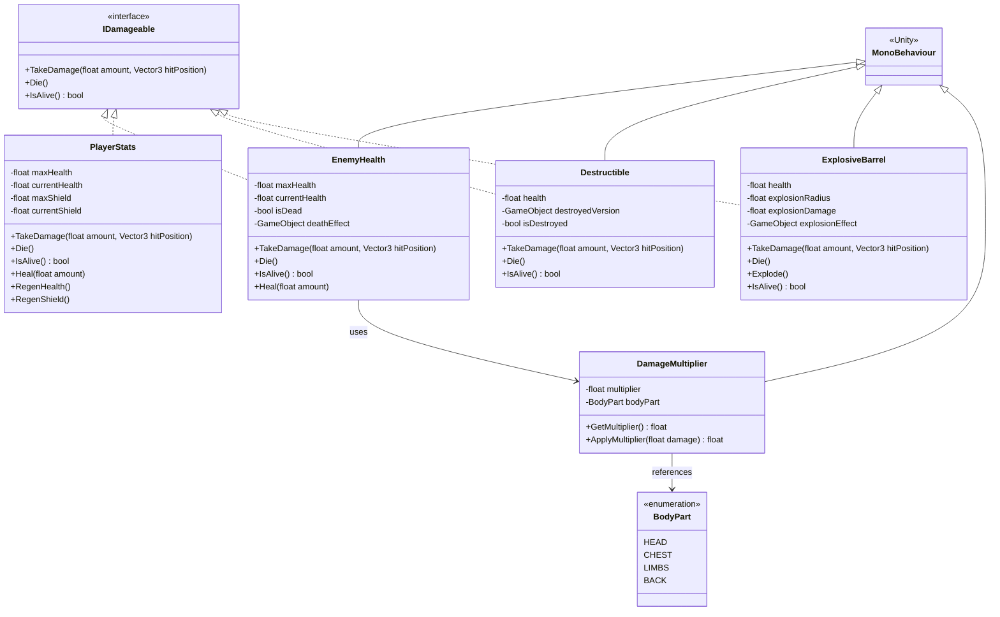
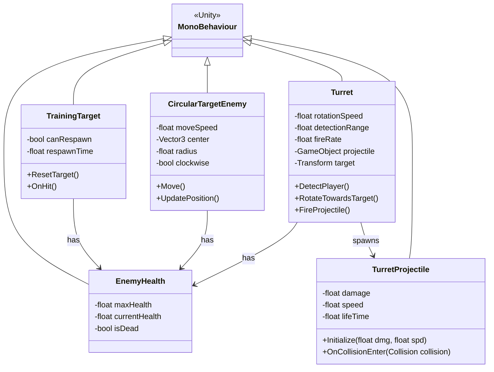
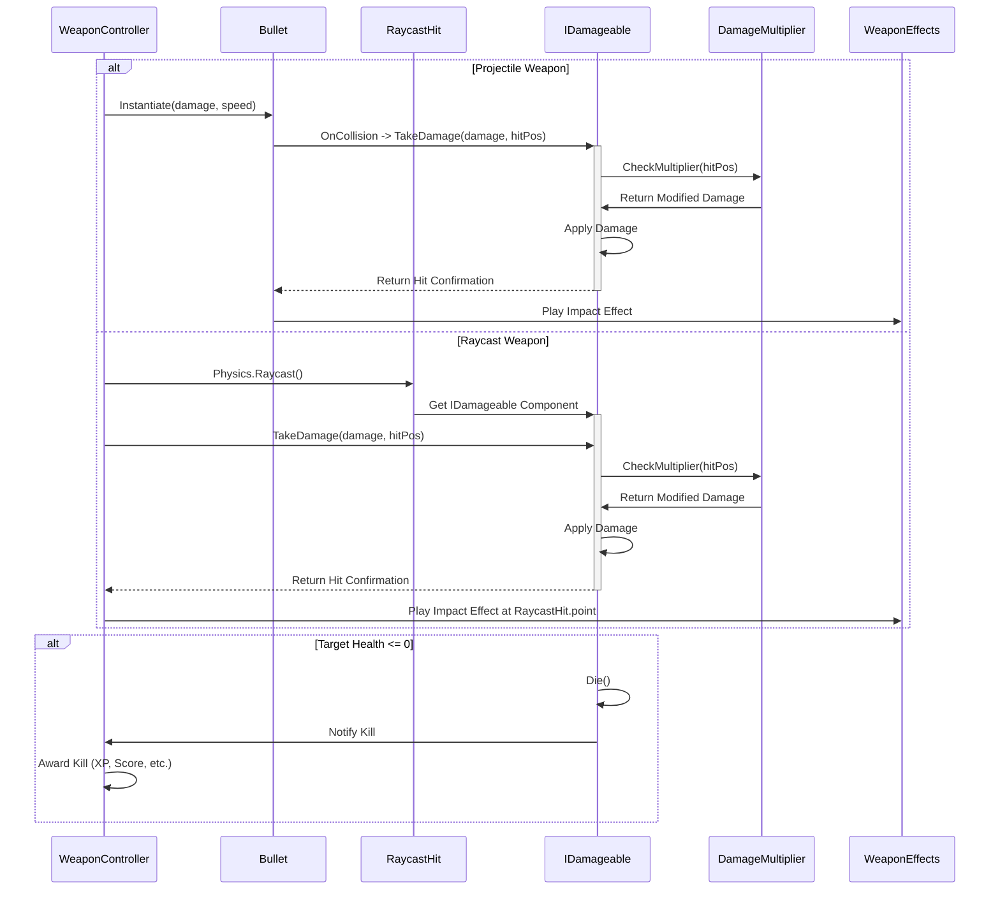
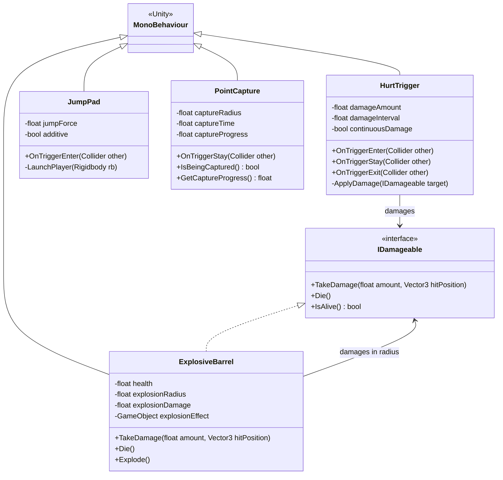

# Enemy and Combat System

This diagram details the Enemy and Combat System architecture, showing classes, relationships, and the damage system mechanics.

## Combat Interface Hierarchy



## Enemy Types and Behavior



## Damage Flow System



## Combat Interaction Model

```mermaid
flowchart TB
    subgraph DamageSystem
        ID[IDamageable]
        DM[DamageMultiplier]
    end
    
    subgraph WeaponSystem
        WC[WeaponController]
        Bullet[Bullet]
        GW[GravitonWeapon]
    end
    
    subgraph Enemies
        EH[EnemyHealth]
        TT[TrainingTarget]
        TUR[Turret]
    end
    
    subgraph Environment
        DES[Destructible]
        EB[ExplosiveBarrel]
        HT[HurtTrigger]
    end
    
    subgraph Player
        PS[PlayerStats]
    end
    
    subgraph Effects
        WE[WeaponEffects]
        PE[PoolManager]
    end
    
    WC --> ID: Damage
    Bullet --> ID: Damage
    GW --> ID: Damage
    
    ID --> EH: Implementation
    ID --> DES: Implementation
    ID --> EB: Implementation
    ID --> PS: Implementation
    
    DM --> ID: Modifies
    
    HT --> PS: Damages
    EB --> ID: Area Damage
    
    WE --> PE: Uses
```

## Environmental Hazards and Interactions



The Enemy and Combat System is built on a flexible damage interface that supports various entities:

1. **IDamageable Interface**: The core interface that unifies all combat interactions, implemented by enemies, players, and destructible objects
2. **Damage Multipliers**: Support for locational damage with different multipliers based on hit location
3. **Enemy Variety**: Different enemy types with unique behaviors and attack patterns
4. **Damage Flow**: Detailed flow of how damage is applied from weapons to targets, including projectile and raycast weapons
5. **Environmental Interactions**: Hazards and interactive elements that can cause damage or affect gameplay

This architecture allows for:
- Easy addition of new enemy types that respond to damage consistently
- Flexible damage system that works with both direct-hit weapons and projectiles
- Integration of environmental hazards into the combat ecosystem
- Clear separation of damage dealing (weapons) and damage receiving (enemies, players, objects) with the IDamageable interface

The combat system serves as the backbone of gameplay interactions, connecting player actions, weapon effects, and enemy responses in a cohesive framework.