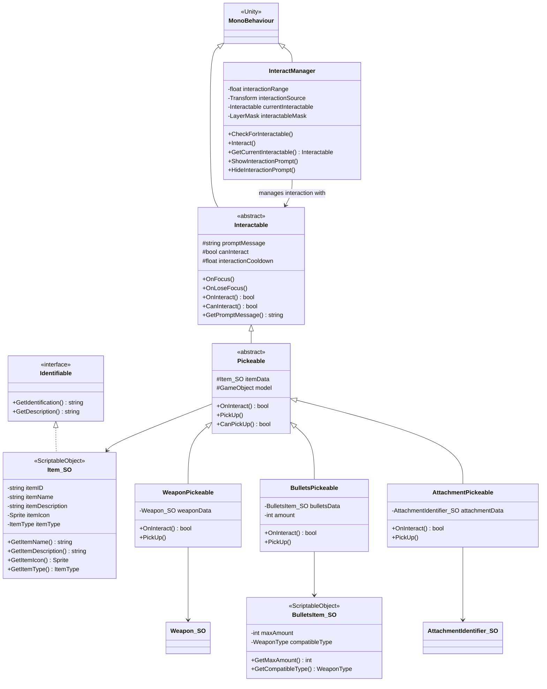
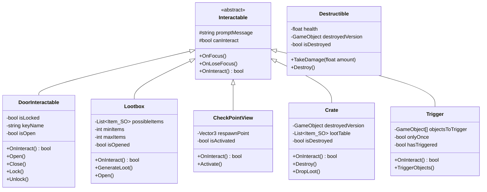
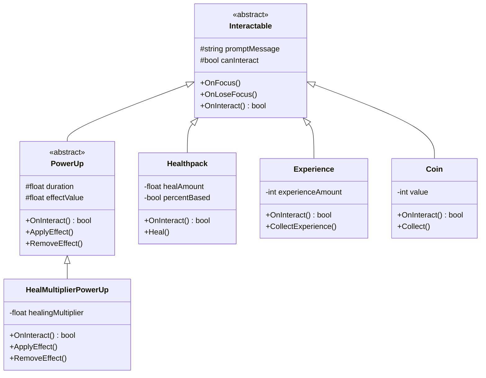
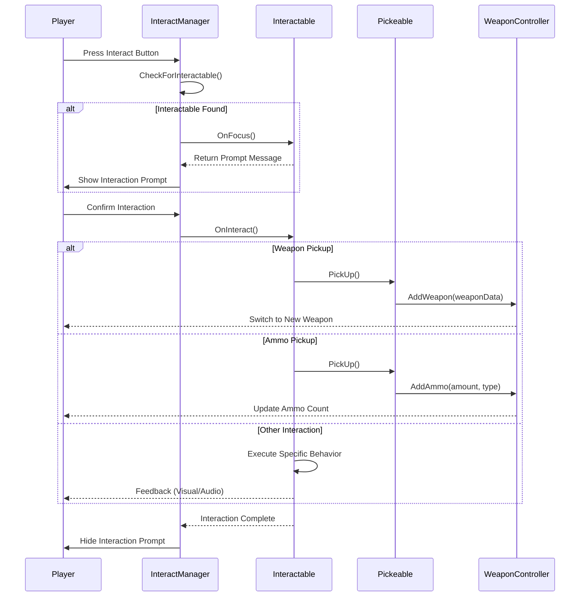
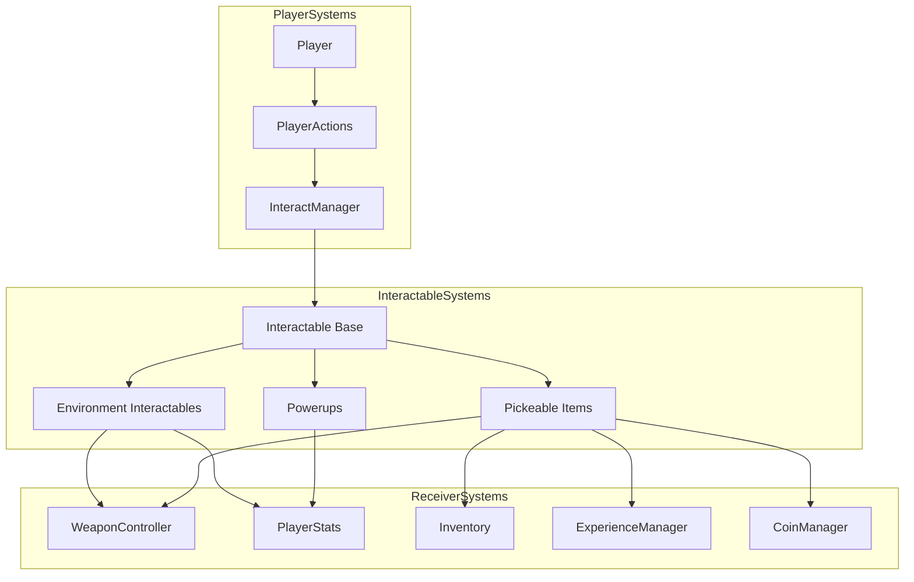

# Interaction Systems

This diagram details the Interaction Systems architecture in Carrot Clash, showing how players interact with the game world through pickups, interactables, and environmental elements.

## Interaction Core Architecture

## Environment Interactables

## Powerups and Collectibles

## Player Interaction Flow

## Interaction Zone Management

The Interaction Systems in Carrot Clash provide a flexible framework for player interactions with the game world:

1. **Core Interaction Architecture**:
   - InteractManager: Central component that detects and manages interactions
   - Interactable: Base class for all interactive objects
   - Pickup System: Specialized system for items that can be collected

2. **Environment Interactables**:
   - Doors, crates, checkpoints, and other interactive environmental elements
   - Consistent interaction interface through the Interactable base class
   - Support for complex behaviors like locked doors requiring keys

3. **Powerups and Collectibles**:
   - Health packs, experience points, coins, and temporary buffs
   - Effect-based architecture allowing for easy addition of new powerup types
   - Duration and effect management for temporary powerups

4. **Player Interaction Flow**:
   - Clear sequence from detecting interactables to applying their effects
   - Support for different interaction types with appropriate feedback
   - Integration with weapon system for adding weapons and ammo

This architecture provides several advantages:
- Easy extension with new interactable types
- Consistent player experience through standardized interaction mechanics
- Clear separation between detection (InteractManager), behavior (Interactable subclasses), and effect (receiver systems)
- Straightforward integration with inventory, weapon, and player systems

The interaction system serves as a crucial bridge between the player and the game world, enabling a wide range of gameplay mechanics from collecting items to activating complex environmental elements.