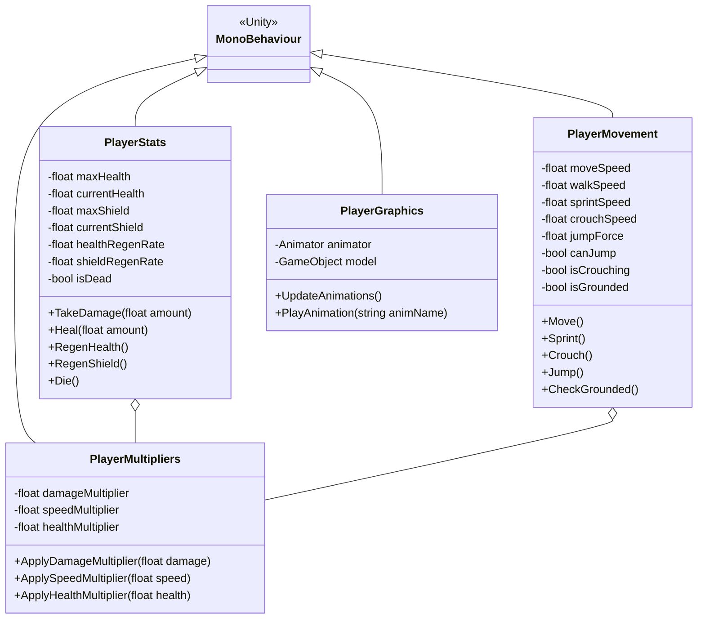
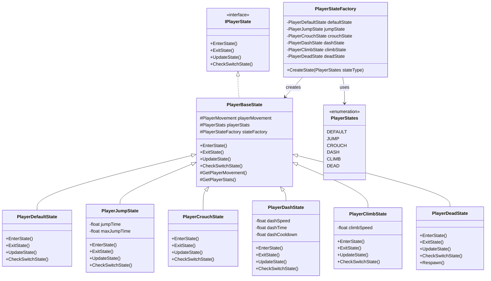
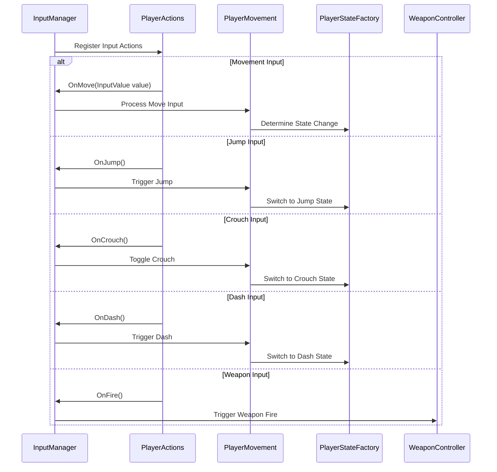
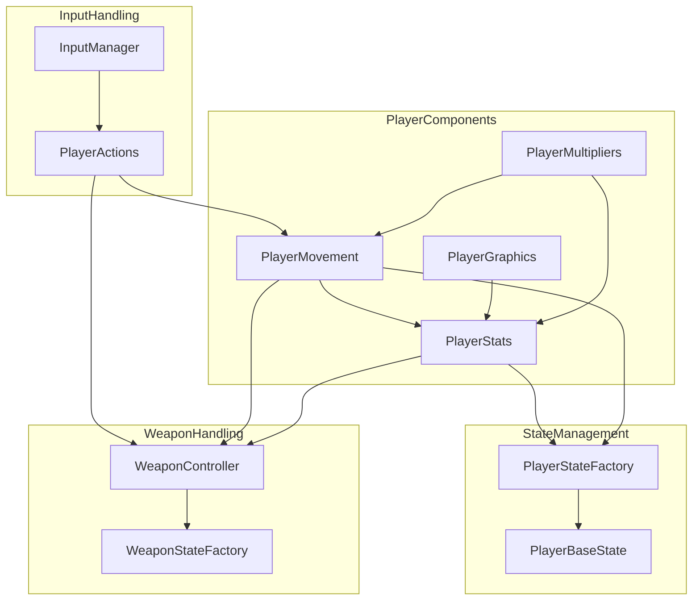

# Player Subsystem

This diagram details the Player Subsystem architecture, showing classes, relationships, and state management for player behavior.

## Player Class Hierarchy

## Player State Management

## Player Input Flow

## Player Component Dependencies

The player subsystem is a complex structure built on several key components:

1. **Core Player Components**: PlayerMovement, PlayerStats, PlayerGraphics, and PlayerMultipliers handle the fundamental player mechanics
2. **State Management System**: Using the State Pattern with a factory to control player behavior states
3. **Input System Integration**: Shows how player input is processed and routed to appropriate subsystems
4. **Component Dependencies**: Illustrates how the various player components depend on each other

The player state system is particularly important as it enables clean transitions between different player behaviors (running, jumping, crouching, etc.) without cluttering the player controller with conditional logic.