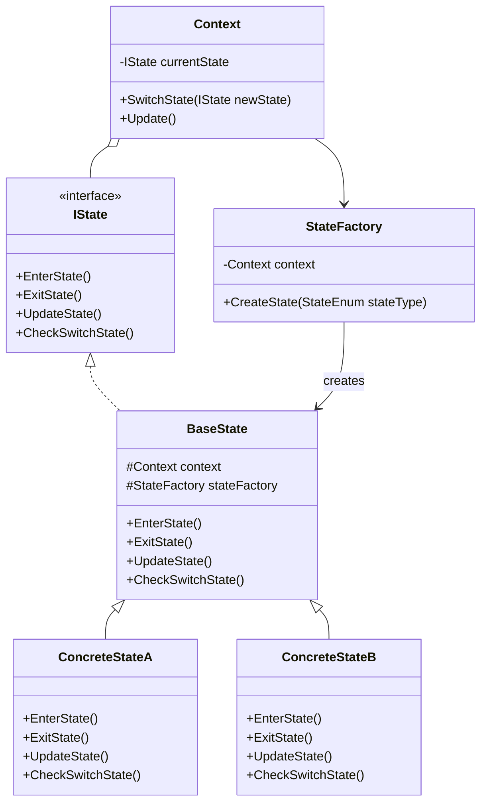
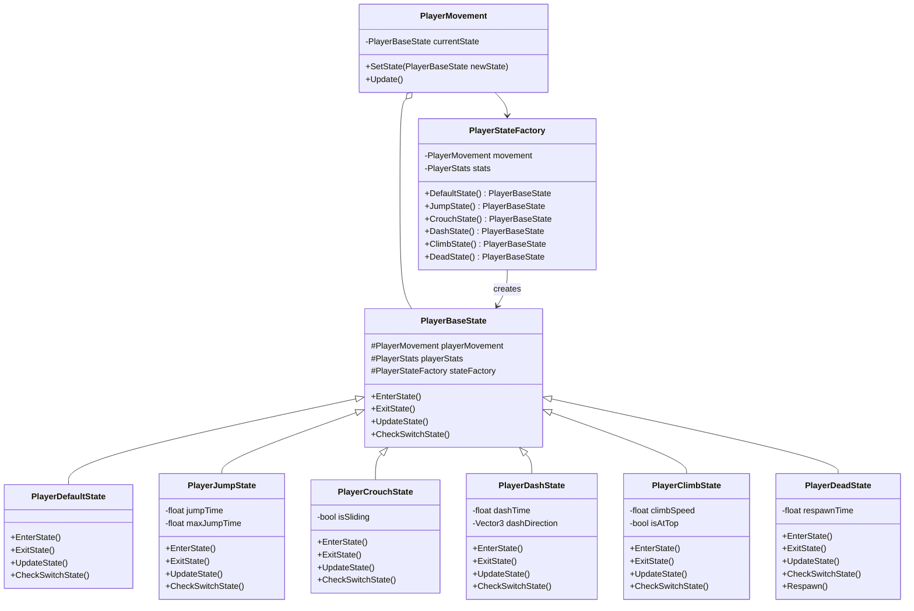
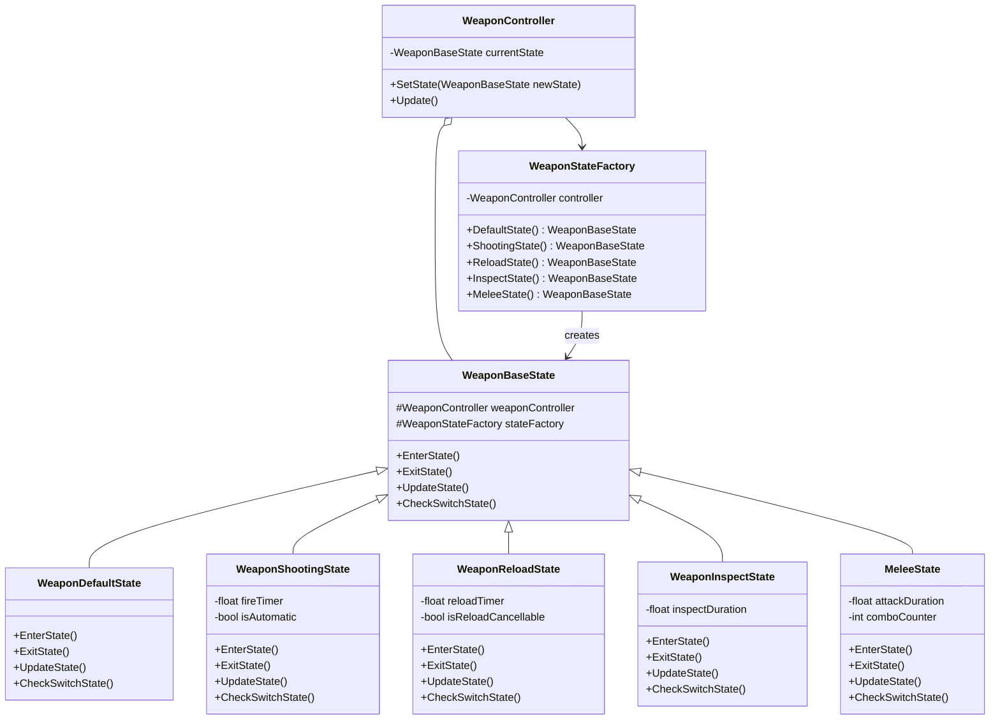
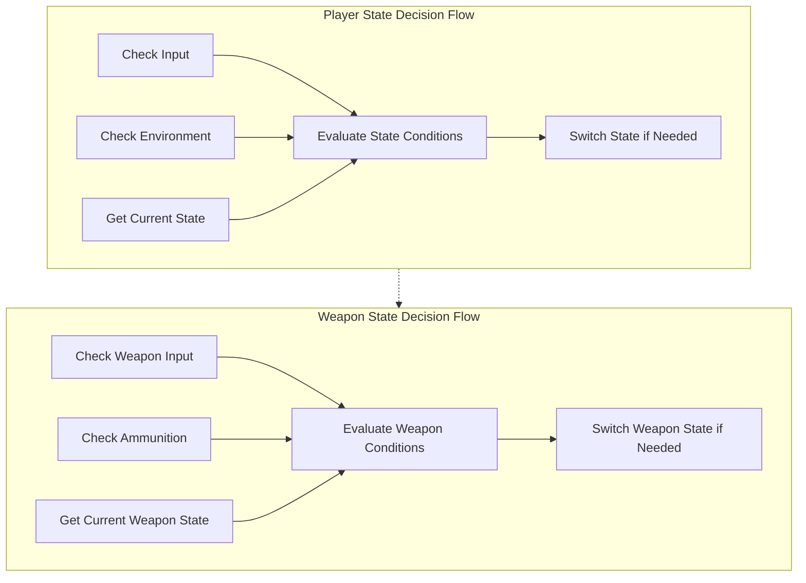

# State Management

This diagram details the State Management architecture used throughout Carrot Clash, focusing on the implementation of the State Pattern for player and weapon systems.

## State Pattern Overview



## Player State Management



## Weapon State Management



## State Transition Diagram - Player

```mermaid
stateDiagram-v2
    [*] --> Default
    
    Default --> Jump: Press Jump Button
    Jump --> Default: Land on Ground
    
    Default --> Crouch: Press Crouch Button
    Crouch --> Default: Release Crouch Button
    
    Default --> Dash: Press Dash Button
    Dash --> Default: Dash Completed
    
    Default --> Climb: Near Climbable Surface
    Climb --> Default: Reach Top/Release Climb
    
    Default --> Dead: Health <= 0
    Jump --> Dead: Health <= 0
    Crouch --> Dead: Health <= 0
    Dash --> Dead: Health <= 0
    Climb --> Dead: Health <= 0
    
    Dead --> Default: Respawn
```

## State Transition Diagram - Weapon

```mermaid
stateDiagram-v2
    [*] --> Default
    
    Default --> Shooting: Press Fire Button
    Shooting --> Default: Complete Shot/Release Fire
    
    Default --> Reloading: Press Reload/Empty Ammo
    Reloading --> Default: Reload Complete
    
    Default --> Inspecting: Press Inspect Button
    Inspecting --> Default: Inspection Complete
    
    Default --> Melee: Press Melee Button
    Melee --> Default: Melee Attack Complete
    
    Inspecting --> Shooting: Press Fire Button
    Inspecting --> Reloading: Press Reload Button
    Inspecting --> Melee: Press Melee Button
    
    Shooting --> Reloading: Empty Ammo
    Reloading --> Shooting: Cancel Reload + Press Fire
```

## State Decision Flow



The State Pattern implementation in Carrot Clash offers several key advantages:

1. **Clean Separation of Behaviors**: Each state encapsulates specific behavior, making the code more organized and maintainable
2. **Reduced Conditional Logic**: Instead of complex if/else chains, behavior is determined by the current state object
3. **Easier State Transitions**: State transitions are handled by the state objects themselves through their CheckSwitchState method
4. **Extensibility**: New states can be added with minimal changes to existing code
5. **Reusability**: The pattern is applied consistently across different systems (player and weapons)

State management is a core architectural pattern in the game, handling:
- Player movement states (running, jumping, crouching, etc.)
- Weapon operation states (shooting, reloading, inspecting)
- Clear transition rules between states
- Hierarchical relationships between states

This approach results in more maintainable code that can be extended with new behaviors without disrupting existing functionality, while keeping the core logic of each component clean and focused.