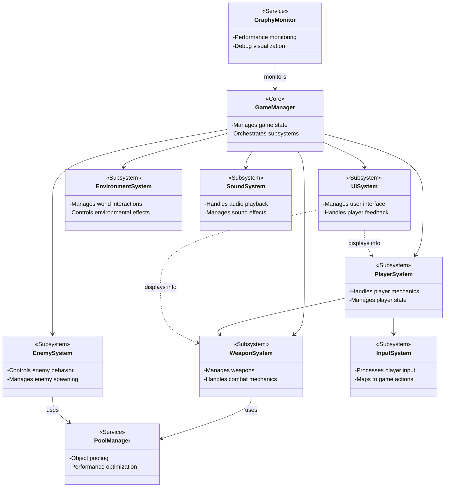
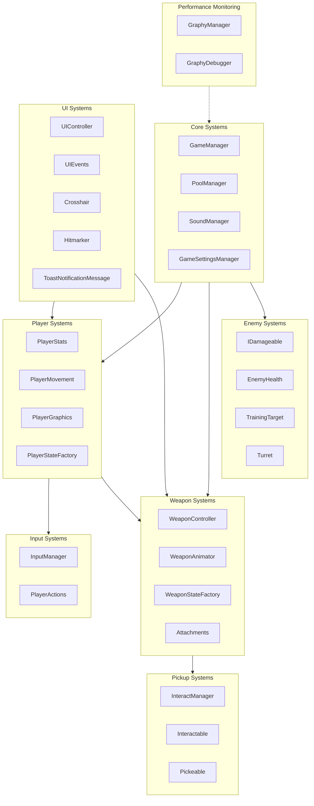
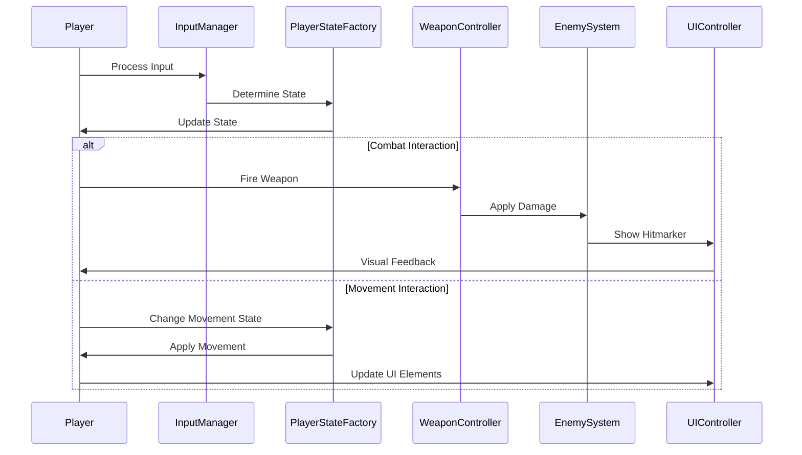

# High-Level System Architecture

This diagram represents the top-level architecture of the Carrot Clash game, showing major subsystems and their interactions.

## System Components Overview

## Subsystem Dependency Diagram

## Communication Flow Diagram

The diagrams above illustrate the high-level architecture of the Carrot Clash game system:

1. **System Components Overview**: Shows the major subsystems and their relationships
2. **Subsystem Dependency Diagram**: Illustrates how the various subsystems depend on each other
3. **Communication Flow Diagram**: Demonstrates how data and commands flow between components during typical gameplay operations

These diagrams provide a foundation for understanding the overall system architecture before diving into more detailed subsystem diagrams.