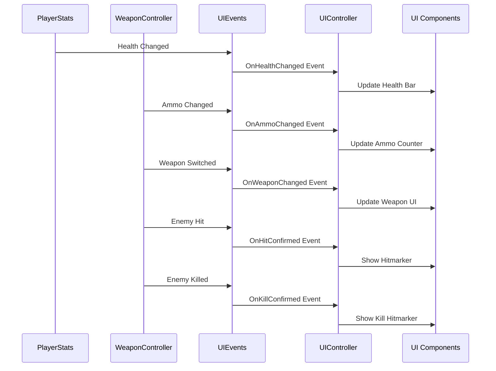
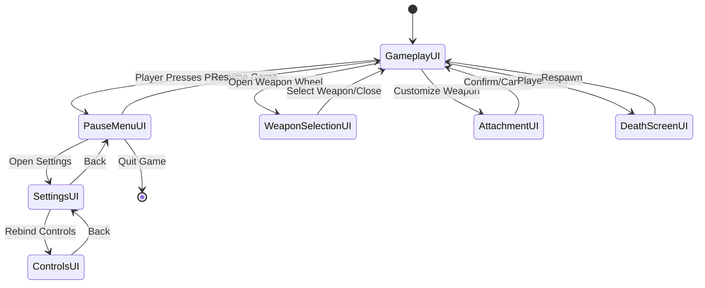
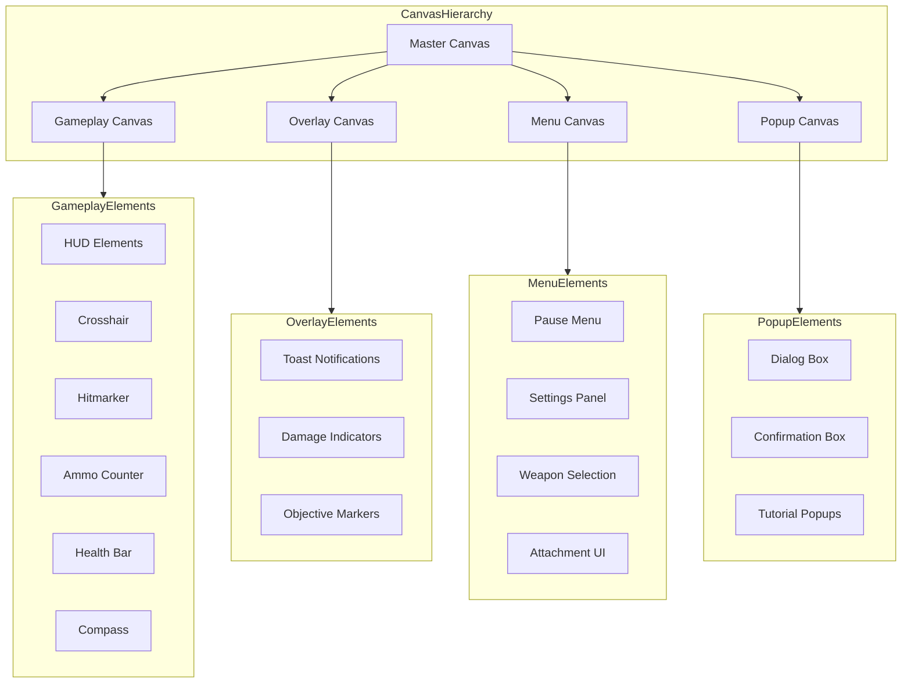
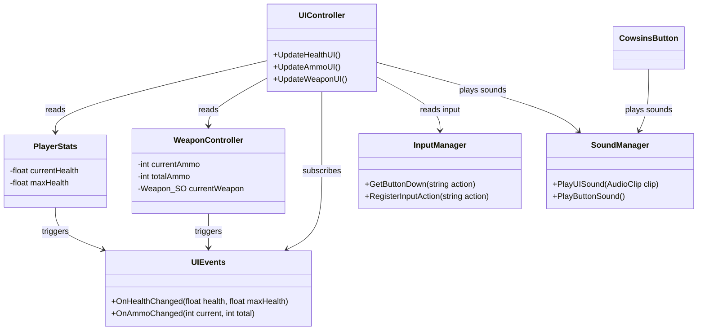

# UI System

This diagram details the UI System architecture, showing classes, relationships, and how UI components interact with gameplay systems.

## UI Component Structure

```mermaid
classDiagram
    direction TB
    
    class MonoBehaviour {
        <<Unity>>
    }
    
    class UIController {
        -PlayerStats playerStats
        -WeaponController weaponController
        -UIElements uiElements
        
        +UpdateHealthUI()
        +UpdateAmmoUI()
        +UpdateWeaponUI()
        +UpdateObjectiveUI()
        +TogglePauseMenu()
        +ShowGameOverScreen()
    }
    
    class UIEvents {
        +OnHealthChanged(float health, float maxHealth)
        +OnAmmoChanged(int current, int total)
        +OnWeaponChanged(Weapon_SO weapon)
        +OnObjectiveUpdated(string objective)
        +OnGameStateChanged(GameState state)
        +OnKillConfirmed()
    }
    
    class Crosshair {
        -CrosshairShape crosshairShape
        -float baseSize
        -float currentSize
        -bool dynamic
        
        +UpdateCrosshair()
        +ExpandOnShoot()
        +ResetSize()
        +SetColor(Color color)
    }
    
    class CrosshairShape {
        -List~Vector2~ points
        -float thickness
        -Color color
        
        +Draw()
        +SetPoints(List~Vector2~ newPoints)
    }
    
    class Hitmarker {
        -float displayTime
        -bool isDisplaying
        -AudioClip hitSound
        -AudioClip killSound
        
        +ShowHitmarker(bool isKill)
        +HideHitmarker()
    }
    
    class WeaponsInventoryUISlot {
        -Image weaponIcon
        -Text weaponName
        -WeaponController weaponController
        
        +Initialize(Weapon_SO weapon)
        +SelectSlot()
        +DeselectSlot()
    }
    
    class AttachmentUIElement {
        -AttachmentType attachmentType
        -Image icon
        -Button selectButton
        
        +Initialize(AttachmentIdentifier_SO attachment)
        +Select()
        +Deselect()
    }
    
    class AttachmentGroupUI {
        -List~AttachmentUIElement~ elements
        -AttachmentType groupType
        
        +AddElement(AttachmentUIElement element)
        +RemoveElement(AttachmentUIElement element)
        +ToggleVisibility(bool visible)
    }
    
    class RebindUI {
        -InputManager inputManager
        -Text actionText
        -Button rebindButton
        -string actionName
        
        +StartRebind()
        +EndRebind()
        +UpdateBindingDisplay()
    }
    
    class ToastNotificationMessage {
        -float displayTime
        -float fadeTime
        -Queue~Notification~ messageQueue
        
        +ShowNotification(string message, NotificationType type)
        +ProcessMessageQueue()
    }
    
    class ToastNotification {
        -string message
        -NotificationType type
        -float duration
        
        +Show()
        +Hide()
        +SetMessage(string message)
    }
    
    class NotificationType {
        <<enumeration>>
        INFO
        WARNING
        ERROR
        SUCCESS
    }
    
    class CowsinsButton {
        -AudioClip hoverSound
        -AudioClip clickSound
        -float scaleOnHover
        
        +OnPointerEnter()
        +OnPointerExit()
        +OnPointerClick()
    }
    
    MonoBehaviour <|-- UIController
    MonoBehaviour <|-- Crosshair
    MonoBehaviour <|-- CrosshairShape
    MonoBehaviour <|-- Hitmarker
    MonoBehaviour <|-- WeaponsInventoryUISlot
    MonoBehaviour <|-- AttachmentUIElement
    MonoBehaviour <|-- AttachmentGroupUI
    MonoBehaviour <|-- RebindUI
    MonoBehaviour <|-- ToastNotificationMessage
    MonoBehaviour <|-- ToastNotification
    MonoBehaviour <|-- CowsinsButton
    
    UIController --> UIEvents : subscribes
    UIController --> Crosshair : manages
    UIController --> Hitmarker : manages
    UIController --> WeaponsInventoryUISlot : manages
    UIController --> AttachmentGroupUI : manages
    
    Crosshair --> CrosshairShape : uses
    AttachmentGroupUI --> AttachmentUIElement : contains
    ToastNotificationMessage --> ToastNotification : creates
    ToastNotificationMessage --> NotificationType : uses
```

## UI Information Flow

## UI State and Interaction

## UI Layering and Canvas Management

## UI Component Dependencies

The UI System in Carrot Clash serves as the bridge between gameplay systems and player feedback:

1. **Core UI Components**: Organized structure of UI elements from crosshair and hitmarkers to weapon selection and notifications
2. **Event-Driven Architecture**: Uses an event system (UIEvents) to decouple gameplay systems from UI updates
3. **Layer Management**: Clear hierarchical organization of UI elements based on their purpose and priority
4. **State Management**: Defines clear UI states and transitions between gameplay, menus, and overlays
5. **Customization Support**: Dedicated UI components for weapon customization and control rebinding

The UI system employs several best practices:
- Event-based communication to avoid direct dependencies between gameplay and UI
- Hierarchical organization of canvases to manage rendering order and input priority
- Component-based design allowing for easy addition or removal of UI elements
- Clear state transitions to handle different game states (playing, paused, customizing)

This modular approach allows for flexible UI updates as the game evolves, with a clear separation between game logic and visual representation.