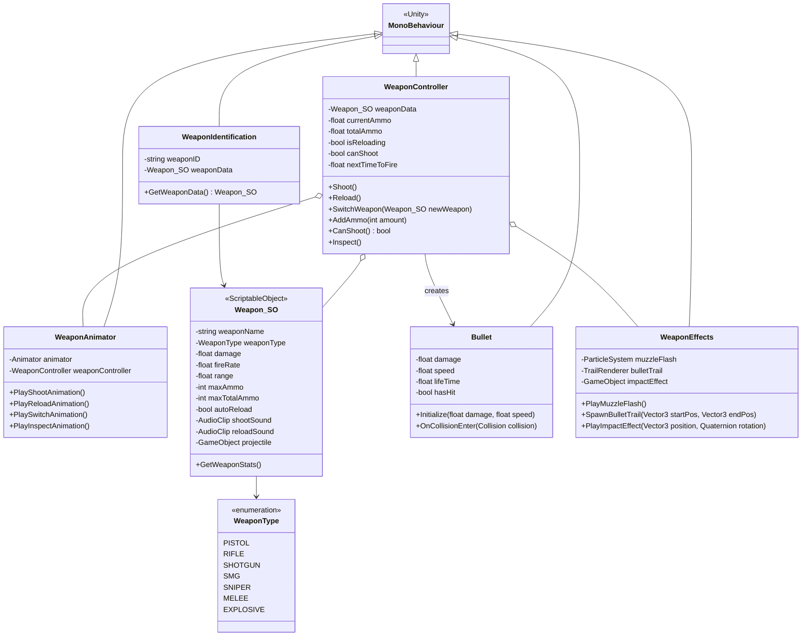
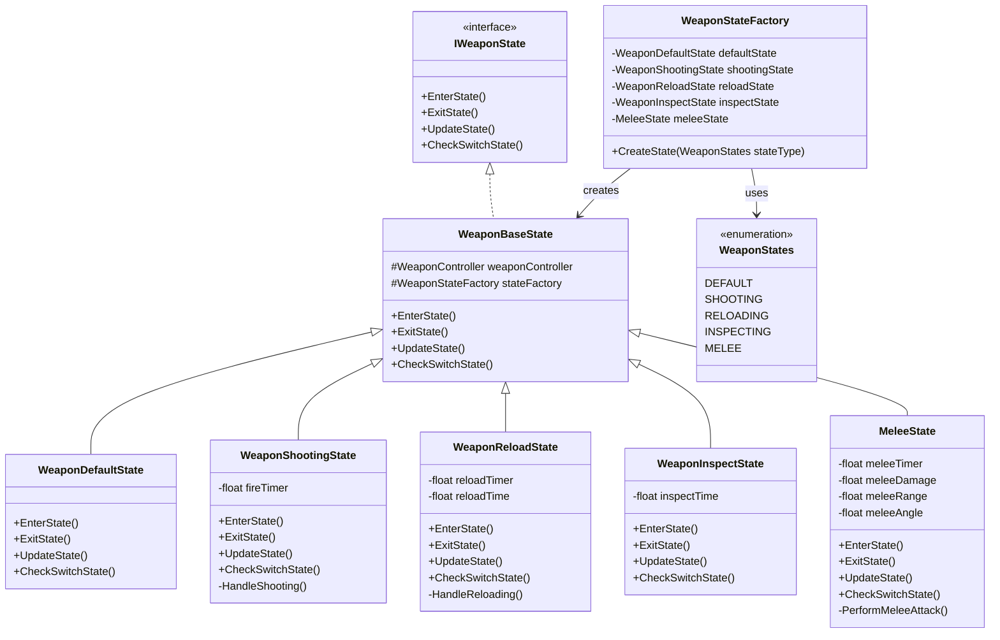
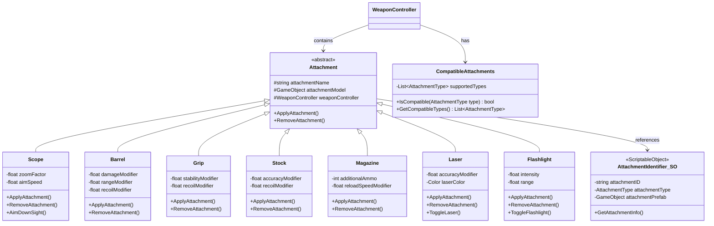
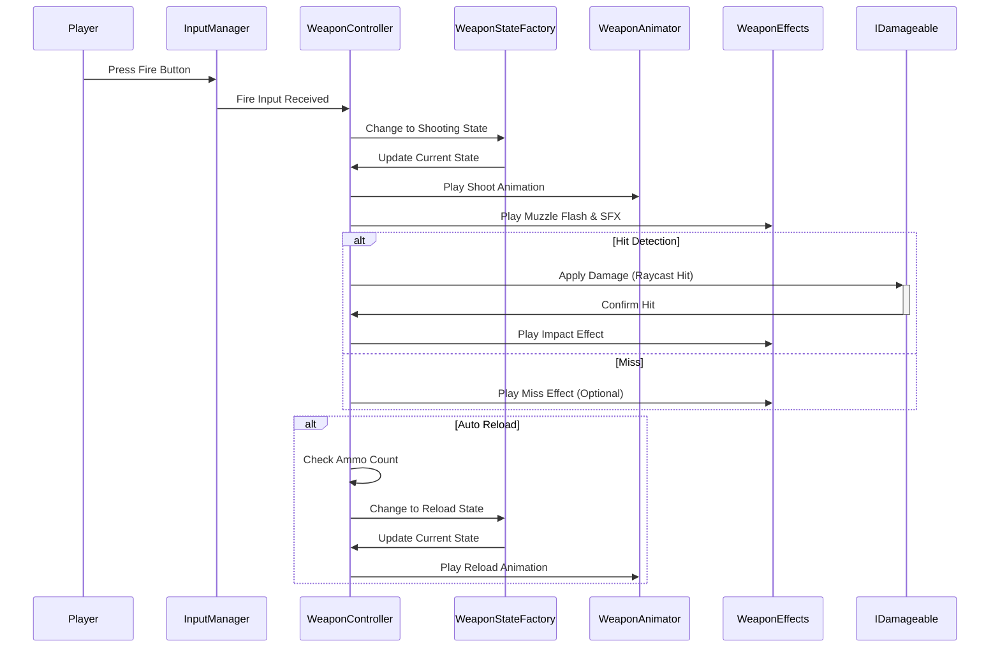
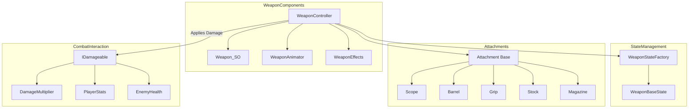

# Weapon System

This diagram details the Weapon System architecture, showing classes, relationships, and state management for weapons, attachments, and combat mechanics.

## Weapon Class Structure

## Weapon State System

## Attachment System

## Weapon Interaction Flow

## Combat System Relationships

The Weapon System is a sophisticated component with several key elements:

1. **Core Weapon Components**: WeaponController, WeaponAnimator, and Weapon_SO (ScriptableObject) handle the core weapon mechanics
2. **State Management**: A dedicated state system for weapons that handles different states like shooting, reloading, and inspecting
3. **Modular Attachment System**: A flexible attachment system allowing players to customize weapons with various attachments
4. **Combat Interaction Flow**: Detailed sequence showing how player input translates to weapon actions and damage application
5. **System Relationships**: Shows how the weapon system connects to other game systems like player stats and enemy health

The weapon system is designed to be highly modular, allowing for easy addition of new weapon types and attachments while maintaining a clean architecture.